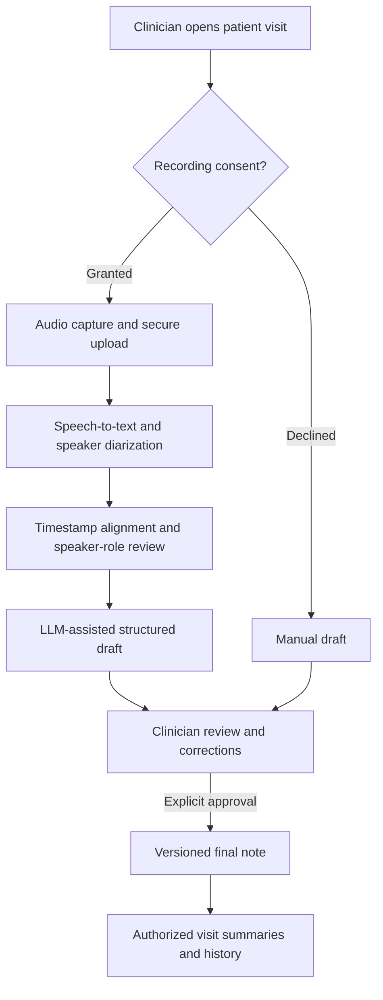

# AI-Powered Medical Note-Taking App

**An academic system design case study for an ambient clinical documentation assistant.**

How could a clinician turn a consented doctor–patient conversation into a structured, reviewable visit note? This project explores that workflow through requirements analysis, UML diagrams, a visit-centered domain model, interface wireframes, and a proposed voice AI architecture.

> **Project status: design proposal.** This repository contains documentation and design artifacts. It has no implemented application, deployed service, trained model, clinical validation, or measured performance results. Screens are academic wireframes; benefits and budgets are estimates.

[Architecture](docs/architecture.md) · [Voice AI design](docs/voice-ai-design.md) · [Original diagrams](docs/diagrams/README.md) · [Wireframes](docs/wireframes/README.md) · [Original report](docs/originals/final-project-report.docx)

## The problem and proposed experience

Clinical documentation competes with the clinician’s attention during an encounter. The proposal explores whether capturing a conversation and preparing an editable draft could reduce documentation effort while keeping the clinician responsible for the final record. Those benefits remain hypotheses to evaluate.

1. Open the patient profile and create a visit.
2. Ask for recording consent. If declined, continue with manual documentation.
3. Capture audio, transcribe speech, and distinguish speaker turns.
4. Prepare **Patient Narrative**, **Doctor Assessment and Plan**, and **Visit Summary** sections.
5. Let the clinician compare the draft with its source, correct it, and explicitly finalize it.
6. Support post-visit typed notes, voice narration, visit search, and authorized summaries.

## Proposed architecture at a glance

The clinical workflow comes from the original proposal. The processing boundaries below are **portfolio design refinements**, not implemented infrastructure. Each arrow represents a proposed flow.



## What this case study demonstrates

| Area | Design evidence |
| --- | --- |
| Healthcare workflow analysis | Consent, clinician approval, patient history, supplemental notes, and manual fallback |
| Voice AI reasoning | Separation of speech recognition, diarization, speaker-role assignment, and clinical summarization |
| System modeling | Use-case, activity, sequence, domain, and state diagrams from the academic project |
| Architecture tradeoffs | Batch versus streaming processing, modular services, data provenance, and controlled finalization |
| Evaluation thinking | Proposed tests for transcription, speaker attribution, unsupported statements, and documentation effort |

## Scope and implementation status

| Capability | Original academic scope | Repository status |
| --- | --- | --- |
| Patient profiles, consent, recording | User stories, use cases, and wireframes | Designed; not implemented |
| Speech-to-text and doctor/patient separation | Proposed requirements | No model integration or evaluation |
| Structured clinical notes | Medical NLP workflow; STT/LLM cost assumptions | Proposed; no prompts, inference service, or generated-note results |
| Clinician review, finalization, additional notes | Detailed workflow and state model | Designed; not implemented |
| Search, dashboards, admin/patient summaries | Proposed requirements and iteration plan | Not implemented |
| Queued processing, source-linked output, detailed LLM safeguards | Added portfolio architecture analysis | Proposed refinement |
| EHR interoperability, multilingual support | Future exploration in this case study | Not implemented or validated |

No specific framework, cloud provider, STT engine, diarization model, or LLM has been selected or benchmarked. The original report mentions cloud and AI services as planning assumptions.

## Read the case study

- **[Requirements and clinical use cases](docs/requirements.md):** actors, workflow boundaries, traceability, and acceptance scenarios.
- **[System architecture](docs/architecture.md):** components, data ownership, processing lifecycle, and design decisions.
- **[Voice AI and clinical note generation](docs/voice-ai-design.md):** attribution, grounding, uncertainty, and human review.
- **[Healthcare risks and evaluation](docs/risks-and-evaluation.md):** proposed safeguards, failure cases, and evidence needed before a pilot.
- **[Roadmap and feasibility](docs/roadmap.md):** a staged path to a prototype and limitations of the academic estimates.
- **[Source inventory and provenance](docs/source-inventory.md):** all reviewed materials, original versus new analysis, and known inconsistencies.

```text
docs/
├── architecture.md
├── requirements.md
├── voice-ai-design.md
├── risks-and-evaluation.md
├── roadmap.md
├── source-inventory.md
├── diagrams/          # Original figures and proposed Mermaid views
├── wireframes/        # Extracted academic UI designs
└── originals/         # Selected academic documents, unchanged
```

## Academic context and attribution

Developed as **Group 2** coursework for **ISBA 2410: Information Systems Analysis and Design**, Leavey School of Business, **Santa Clara University**, under **Prof. Xiang (Shawn) Wan**, December 2025.

**Team:** Ankita Dhekane, Emily Ros, Himanshu Jangra, Kush Shah, Oliver Gonsalves, Riya Koduru, and Trupti Lone.

This repository presents the group proposal in Trupti Lone’s portfolio. The supplied materials do not establish individual task ownership; no sole-authorship or individual implementation claim is made. The original report remains unchanged. New Markdown architecture analysis is labeled as a portfolio refinement and does not retroactively describe completed coursework or implementation.

## Design limitations

The proposal is for documentation assistance, with clinician approval required before finalization. It does not demonstrate autonomous diagnosis, treatment recommendations, EHR integration, HIPAA compliance, or production readiness. The original financial and productivity estimates are classroom assumptions, not business or clinical outcomes. See the [feasibility review](docs/roadmap.md) for unresolved discrepancies.

There is no installation or demo to run. Start with the architecture and original diagrams to review the design.
