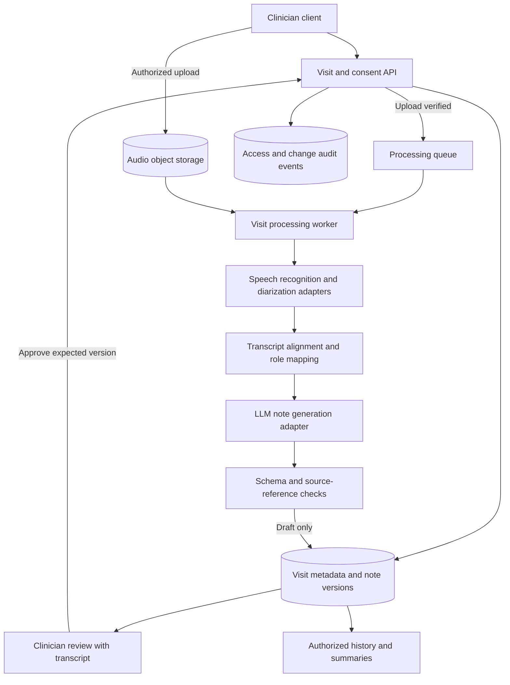

# Proposed system architecture

[Back to the case study](../README.md)

**Status:** conceptual architecture. The original coursework supplies the visit workflow and domain entities. Service boundaries, asynchronous jobs, provenance, and consistency rules below are **portfolio refinements** proposed for a future implementation.

## Component responsibilities

The model boxes are logical responsibilities; they do not prescribe separate microservices. An initial prototype could use a modular backend plus a worker, reducing deployment complexity while keeping model providers replaceable. All client requests and worker operations would need authorization scoped to the visit and organization.

## Processing and trust boundaries

| Boundary | Proposed contract | Failure behavior |
| --- | --- | --- |
| Client → visit API | Authenticated actor, patient ID, visit ID, consent decision | Deny access or recording if prerequisites are missing |
| Client → audio storage | Short-lived upload authorization tied to one visit; completion verified server-side | Mark incomplete uploads and prevent downstream processing |
| Worker → speech services | Authorized audio reference, job ID, model configuration | Bounded retries; visible failed state; manual alternative |
| Speech → generation | Timestamped transcript version, confirmed/unknown roles, labeled history | Flag ambiguous inputs; do not infer missing clinical facts |
| Generation → draft store | Expected schema, valid source references, input/model versions | Reject malformed output; retain a recoverable job failure |
| Clinician → final note | Explicit approval of the exact reviewed version | Reject stale approval and request review of the current draft |

A queue message would carry identifiers rather than raw clinical content. Object storage would hold audio; the database would hold visit associations, consent, transcript references, note versions, and job state. The backend would authorize retrieval of content. General application logs would contain operational metadata rather than full transcripts or prompts.

## Domain model

The original model centers on **Visit**, linking a Doctor and Patient to Consent, ConsultationRecording, Transcript, StructuredNote, ScribbleNote, and VoiceNarration. Patient context includes MedicalProfile, Allergy, and Medication. UserAccount generalizes Doctor and Admin. See the [original domain diagram](diagrams/originals/domain-model.png).

The following are proposed extensions rather than an implemented database schema:

| Entity | Additional design detail | Reason |
| --- | --- | --- |
| Consent | Decision, scope, version, timestamp, withdrawal event | Explain what processing was authorized and when |
| Recording | Storage reference, checksum, upload state, retention deadline | Detect incomplete input and manage audio lifecycle |
| Transcript version | Segment IDs, times, speaker labels, role corrections, model version | Trace note statements back to their input |
| Note version | Input versions, draft/final status, editor, approver, approval time | Keep generated drafts distinct from approved records |
| Processing job | Stage, attempt count, error category, idempotency key | Recover without creating duplicate active drafts |
| Audit event | Actor, action, resource ID, timestamp | Explain access and changes without duplicating PHI in logs |

A production schema would need multiple recordings/transcript versions per visit, deletion semantics, organization boundaries, and addenda. The original one-to-one simplifications do not settle those details. The original UserAccount includes a passwordHash attribute, but authentication and credential lifecycle are not implemented. An identity provider and secure credential handling would need separate design.

## Proposed decisions and tradeoffs

| Decision | Rationale | Cost or unresolved question |
| --- | --- | --- |
| Begin with processing after recording stops | A complete encounter is available before summarization; follows the original Recorded → Transcribing flow | Draft arrives after the encounter; latency must be measured |
| Keep STT, diarization, and role assignment logically distinct | Text accuracy and speaker attribution can fail independently | Timestamp alignment and correction propagation add complexity |
| Use a modular backend plus background worker initially | Supports long-running jobs without committing to distributed microservices | Worker capacity, timeouts, and queue behavior still need testing |
| Store audio separately from structured metadata | Audio and note records have different access and retention needs | Referential integrity and deletion must span both stores |
| Require human approval of a versioned draft | Reflects the original Review & Edit Notes use case | Review burden may erase the expected time savings |
| Keep historical context explicitly labeled | Avoid presenting old conditions or medications as new encounter facts | Requires context selection and conflict display |
| Defer automatic EHR writes | Identity matching, mapping, and finalization must be validated first | Clinicians may initially need a manual export workflow |

Provider selection remains open. Compare data-handling terms, clinical vocabulary errors, overlap handling, deployment constraints, latency, and cost using the same authorized evaluation set. No provider performance claim is made here.

## Reliability invariants

These rules are proposed implementation requirements:

1. Missing or denied consent cannot start audio capture. Consent withdrawal cancels pending work where policy permits and requires explicit handling of in-flight provider calls.
2. Processing jobs use the intended patient, visit, and input version throughout the pipeline.
3. Retried jobs cannot overwrite clinician edits or a finalized note. A newer result becomes a separate draft candidate.
4. Finalization checks the version the clinician reviewed, with a transactional status change and approver record.
5. Later corrections create an addendum or a new controlled version. They do not silently rewrite the final record.
6. Failure at any automated stage leaves a visible status and a manual documentation path.

The [proposed lifecycle](diagrams/proposed-lifecycle.md) makes the failure and manual paths explicit. Durable outbox/event delivery, concurrency control, provider callback validation, and disaster recovery would need implementation and testing before a pilot.
