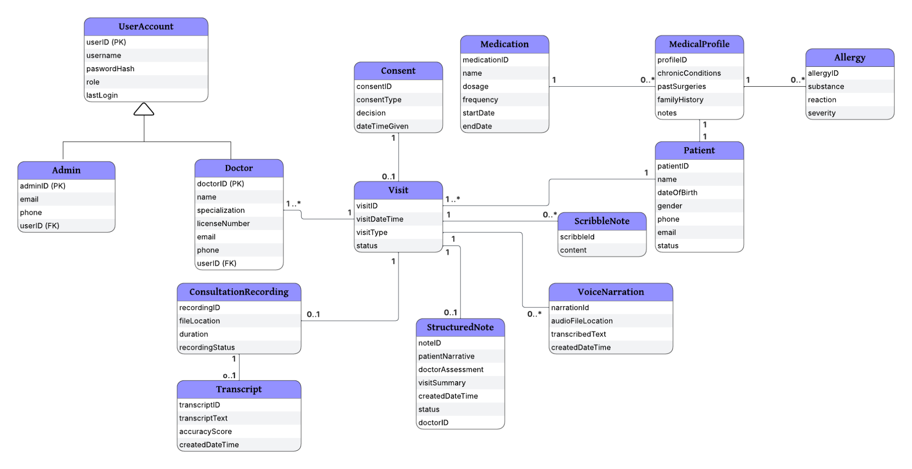

# Architecture and diagram guide

[Back to the case study](../../README.md)

## New architecture views

- [Component architecture](../architecture.md): proposed backend, storage, worker, and review boundaries.
- [Documentation lifecycle](proposed-lifecycle.md): portfolio refinement with failure and manual paths.

These Mermaid diagrams are new design analysis. GitHub renders them directly from Markdown.

## Original academic diagrams

The files below are original standalone PNGs or unchanged embedded image bytes extracted from academic documents. They represent design artifacts, not running workflows.

| Diagram | What to examine | Source |
| --- | --- | --- |
| [Use cases](originals/use-cases.png) | Doctor, administrator, and patient responsibilities | Standalone project PNG |
| [Consultation activity](originals/consultation-activity.png) | End-to-end actor/system flow | Standalone project PNG |
| [Recording activity](originals/recording-activity.png) | Start, capture, stop, and save sequence | Modified Diagrams.docx, image1 |
| [Note review activity](originals/note-review-activity.png) | Draft versus final decisions | Modified Diagrams.docx, image2 |
| [System sequence](originals/system-sequence.png) | Visit and consent interaction messages | Standalone project PNG |
| [Domain model](originals/domain-model.png) | Visit-centered relationships and clinical artifacts | Final report, image9 |
| [Visit state machine](originals/visit-state-machine.png) | Consent, recording, transcription, and notes lifecycle | Final report, image12 |
| [Iteration-one dependency network](originals/iteration-one-network.png) | Planned task dependencies | Project network diagram.docx, image1 |
| [Iteration-one Gantt](originals/iteration-one-gantt.png) | Academic delivery planning | Final report, image14 |

### Domain model preview

## Interpretation notes

The original sequence diagram’s consent alternative contains ambiguous “continue with recording” wording on the false-consent path. The report’s written requirement is authoritative for this case study: **denied consent must prevent recording**. The original image remains unchanged; the new overview and lifecycle show the intended branch.

The UML model is conceptual. Relationships do not establish a production schema, secure credential storage, or implemented authorization. The original network and Gantt artifacts are scheduling proposals, not evidence of completed engineering work. Some images have small labels; open the original file to inspect it at full resolution.
