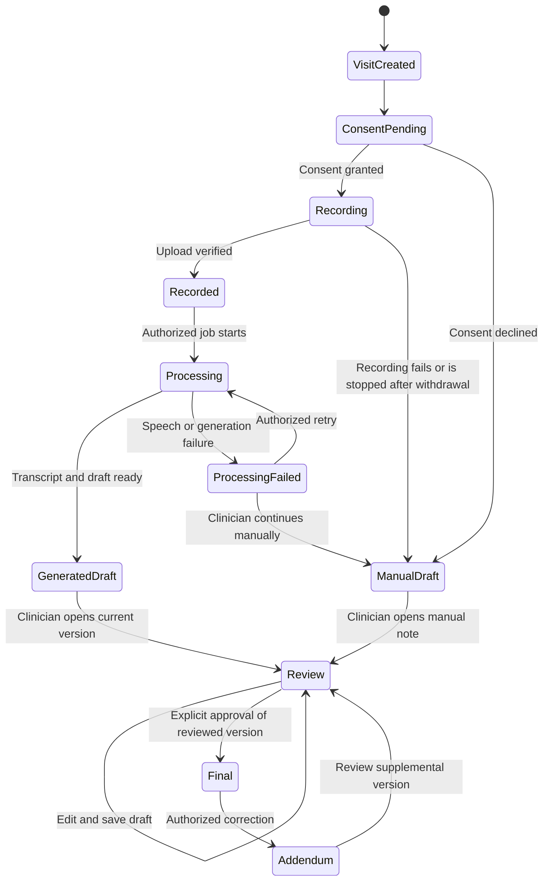

# Proposed documentation lifecycle

[Architecture](../architecture.md) · [Original diagrams](README.md)

This is a **portfolio refinement** of the academic visit state model. It makes manual documentation and processing failures explicit; it does not represent an implemented state machine.

For readability, this view omits upload substates and individual STT/diarization/generation jobs. A detailed implementation must track those separately, including cancellation and in-flight results after consent withdrawal. Reviewing an addendum does not unlock or replace the original final note.
