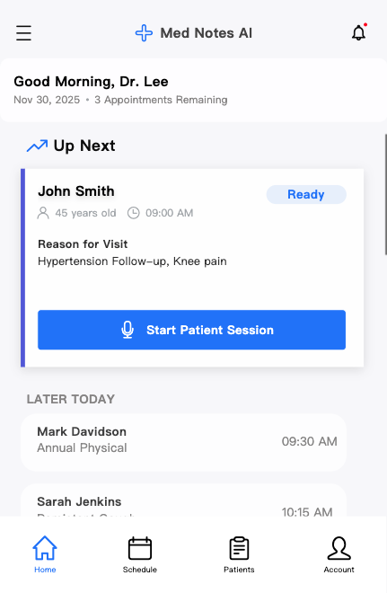
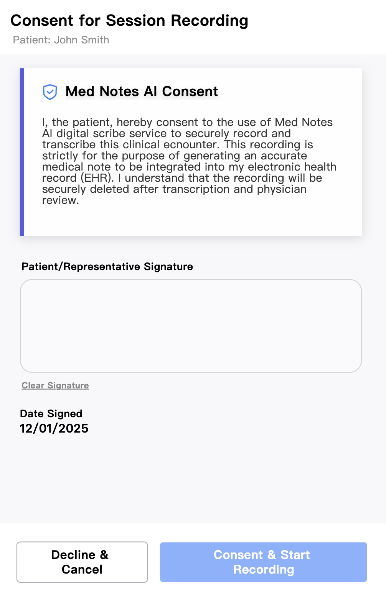
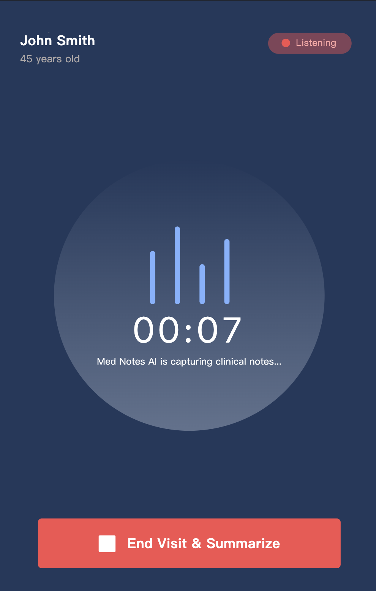
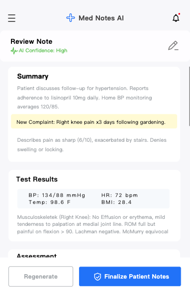
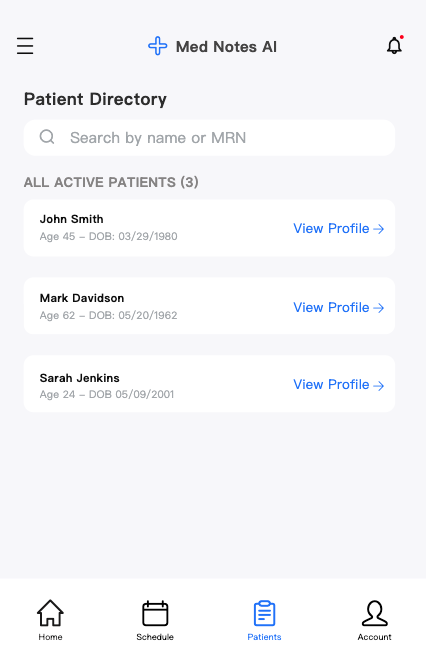
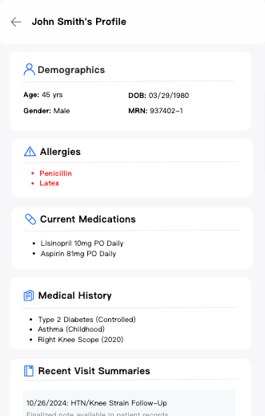

# Original academic wireframes

[Back to the case study](../../README.md)

These six interface images are extracted unchanged from the final academic report. They illustrate the proposed experience and are **not screenshots of an implemented application**. Names, clinical values, the recording timer, and the confidence label appear as interface example content; no working behavior or model output is established by these screens.

## Consultation documentation

| Open a visit | Request consent |
| --- | --- |
|  |  |

| Record the conversation | Review the draft |
| --- | --- |
|  |  |

## Patient context

| Find a patient | Review history |
| --- | --- |
|  |  |

## Design questions surfaced by the screens

- The consent screen’s deletion promise needs a defined retention policy covering provider copies and failures.
- The review screen’s “AI Confidence: High” text has no evaluation behind it. Specific uncertainty and evidence indicators would need validation.
- The proposed interface still needs transcript comparison, speaker-role correction, processing-failure states, and an explicit manual path.
- Patient context and visit documentation need clear boundaries so historical information cannot appear as a new observation.
